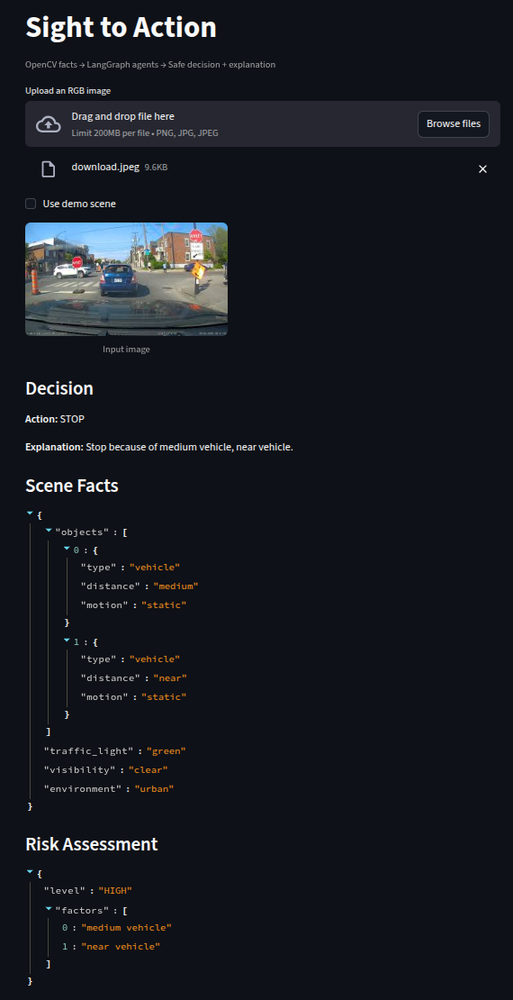

# Sight to Action



Lightweight, modular demo showing how to turn a single RGB image into structured scene facts, run LangGraph agents for risk/decision/explanation, and surface an auditable action.

## Features
- OpenCV-based deterministic heuristics for visibility, rough obstacle detection, and traffic-light color.
- Normalized JSON scene schema with no raw image data passed to agents.
- LangGraph orchestration of three agents (risk, decision, explanation) with safety-first rules.
- Streamlit UI and Typer CLI; both feed the same pipeline.
- Pytest coverage with synthetic scenes; no external models or API keys required.

## Getting Started
```bash
python -m venv .venv
source .venv/bin/activate
pip install -r requirements.txt
```

### CLI
```bash
python main.py run path/to/image.png
```

### Streamlit UI
```bash
streamlit run streamlit_app.py
```

### Tests
```bash
pytest
```

## How It Works
1. `vt_action.vision.analyze_image` uses OpenCV to derive structured facts (objects, traffic light, visibility, environment).
2. `vt_action.schema.normalize_scene` enforces the schema and deterministic ordering.
3. `vt_action.graph.run_graph` executes LangGraph nodes:
   - Risk agent (hazard + qualitative level)
   - Decision agent (PROCEED/SLOW_DOWN/STOP)
   - Explanation agent (concise, fact-backed rationale)
4. `vt_action.pipeline.evaluate_image` ties everything together for the UI/CLI/tests.

OpenAI API keys are not required; the graph uses rule-based agents for clarity. Add keys later if you plug in LLM-backed agents.
